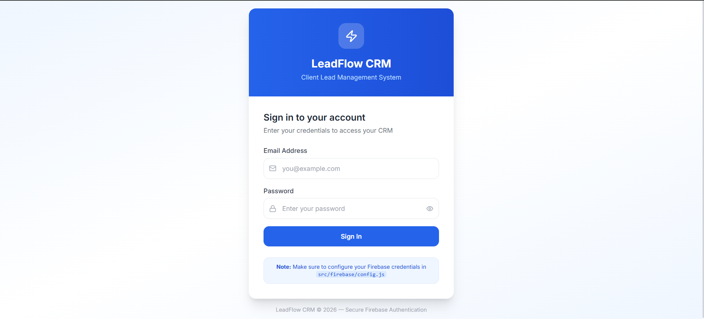

# 👥 LeadFlow CRM



A modern Full-Stack Mini CRM application built with React and Firebase that helps businesses manage client leads, track lead status, organize follow-ups, and improve sales workflow through a clean and responsive dashboard.

---

## 🚀 Live Demo

🔗 https://future-fs-02-mu-bice.vercel.app/login

---

## ✨ Features

- 👥 Client Lead Management
- 📊 Dashboard Overview
- 📌 Lead Status Tracking
- 📅 Follow-up Management
- 🔐 Firebase Authentication
- ⚡ Fast React + Vite Application
- 📱 Responsive User Interface
- 🎯 Modern CRM Workflow

---

## 🛠️ Tech Stack

- React 18
- Vite
- Firebase
- React Router DOM
- Tailwind CSS
- Lucide React
- JavaScript (ES6)

---

## 📂 Project Structure

```text
LeadFlow-CRM/
│
├── public/
├── src/
│   ├── components/
│   ├── pages/
│   ├── services/
│   ├── assets/
│   ├── App.jsx
│   └── main.jsx
│
├── package.json
├── vite.config.js
└── README.md
```

---

## ⚙️ Installation

### Clone Repository

```bash
git clone https://github.com/debraniprl-wq/LeadFlow-CRM.git
```

### Install Dependencies

```bash
npm install
```

### Run Development Server

```bash
npm run dev
```

### Build for Production

```bash
npm run build
```

---

## 🎯 Use Case

LeadFlow CRM enables businesses to:

- Store and manage client leads
- Track lead progress through different stages
- Organize follow-ups efficiently
- Improve customer relationship management
- Monitor sales workflow from a single dashboard

---

## 🚀 Future Improvements

- 📊 Advanced Analytics Dashboard
- 📧 Email & SMS Notifications
- 📅 Calendar Integration
- 🤖 AI-powered Lead Scoring
- 📈 Sales Performance Reports
- 👥 Team Collaboration Features
- 🌙 Dark Mode

---

## 👩‍💻 Author

**Agnimitra Dey**

GitHub: https://github.com/debraniprl-wq

---

⭐ If you found this project useful, consider giving it a star.
